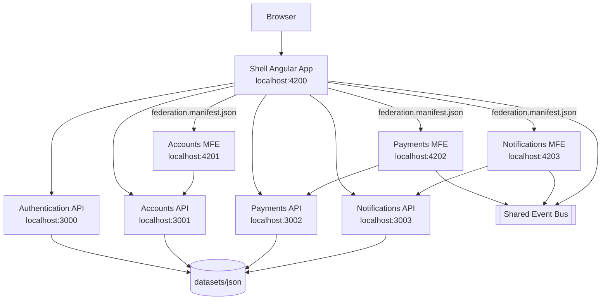
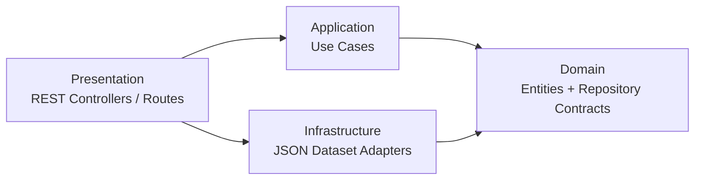
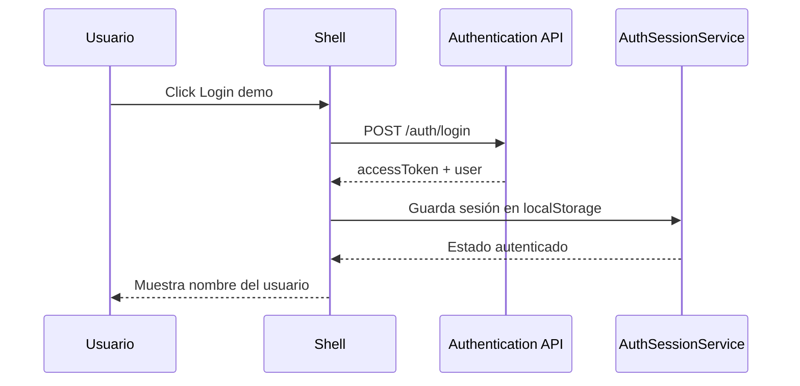
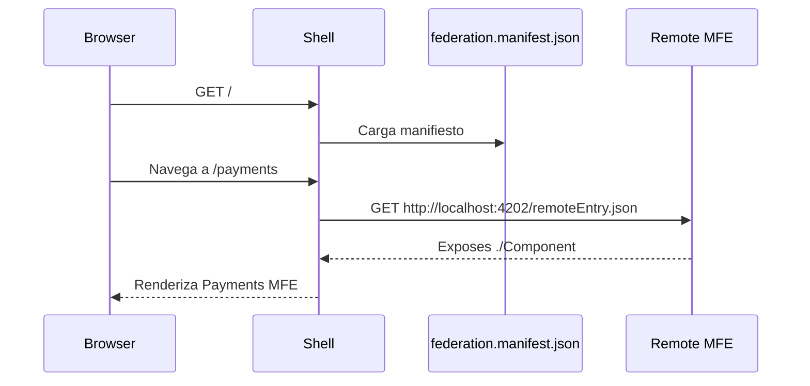
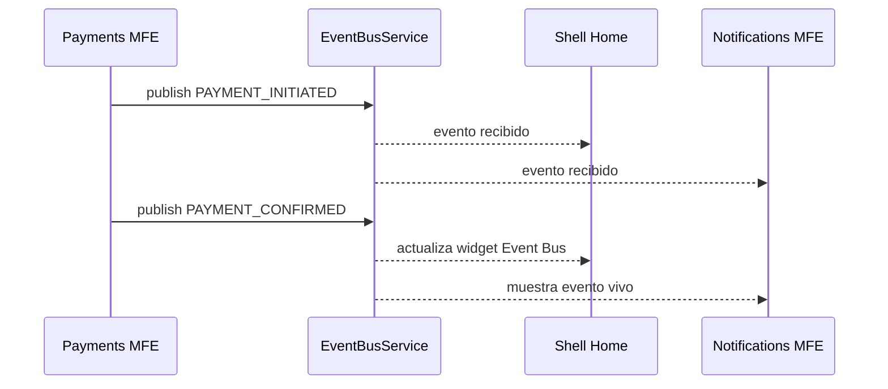

# Payment Processing PoC - Angular Native Federation

## Descripción funcional

Esta PoC implementa un flujo simplificado de **Payment Processing** usando Angular moderno con **Standalone Components** y **Native Federation**. La solución está compuesta por un **Shell** que orquesta la navegación y tres Microfrontends independientes:

- **Accounts MFE**: consulta cuentas, tarjetas y registra beneficiarios.
- **Payments MFE**: inicia pagos, confirma pagos y publica eventos.
- **Notifications MFE**: consulta notificaciones y recibe eventos publicados por otros MFEs.

Cada dominio backend es un servicio REST independiente:

- `authentication-api`
- `accounts-api`
- `payments-api`
- `notifications-api`

Toda la solución corre localmente, usa datasets JSON como fuente mock y no depende de servicios cloud, proveedores reales de identidad ni bases de datos productivas.


## Angular 21 baseline

La PoC está alineada a Angular 21.x:

- Angular framework: `21.2.17`
- Angular CLI: `21.2.18`
- Native Federation: `@angular-architects/native-federation@21.2.5`
- TypeScript: `5.9.3`
- Node.js usado para validar: `22.16.0`
- Configuración Angular moderna sin `provideZoneChangeDetection`, manteniendo compatibilidad con el comportamiento zoneless por defecto de Angular 21+.

## Objetivos de la PoC

1. Demostrar una arquitectura de Microfrontends con Angular, Native Federation y despliegue independiente.
2. Demostrar comunicación entre MFEs mediante un Event Bus compartido.
3. Simular autenticación compartida usando sesión local mock.
4. Simular un flujo de Payment Processing de extremo a extremo.
5. Implementar backends REST separados por dominio usando DDD, Clean Architecture, SOLID y Hexagonal Architecture.
6. Mantener la infraestructura simple, local y limitada a lo necesario para probar el concepto.

## Stack tecnológico

| Capa | Tecnología |
|---|---|
| Frontend | Angular 21.2.x, Standalone Components, Angular Router, zoneless-ready configuration |
| Microfrontends | `@angular-architects/native-federation` |
| Comunicación frontend | Event Bus basado en `CustomEvent` + RxJS |
| Backend | Node.js 22, Express 5, TypeScript 5.9 |
| Validación de comandos | Zod |
| Datasets | JSON local |
| Infraestructura local | Docker Compose + Nginx |
| Requests | REST Client `.http` |
| Testing backend | Node Test Runner |

## Arquitectura general



## Estructura del proyecto

```text
payment-processing-poc/
├── angular.json
├── package.json
├── README.md
├── VALIDATION.md
├── projects/
│   ├── shell/
│   ├── accounts/
│   ├── payments/
│   ├── notifications/
│   └── shared/
├── backends/
│   ├── authentication/
│   ├── accounts/
│   ├── payments/
│   └── notifications/
├── datasets/
│   ├── json/
│   └── scripts/
├── requests/
│   ├── payment-processing-poc.http
│   └── responses/
└── infrastructure/
    ├── docker-compose.yml
    ├── frontend.Dockerfile
    ├── nginx/
    ├── manifests/
    ├── mock-services/
    ├── requests/
    ├── responses/
    └── scripts/
```

## Shell

El Shell es la aplicación principal. Sus responsabilidades son:

- Cargar el `federation.manifest.json`.
- Resolver rutas remotas hacia Accounts, Payments y Notifications.
- Mostrar widgets de resumen del dominio de pagos.
- Gestionar login/logout demo.
- Mantener navegación principal.
- Escuchar eventos del Event Bus.

Rutas principales:

| Ruta | Origen | Descripción |
|---|---|---|
| `/` | Shell | Home con widgets de resumen |
| `/accounts` | Accounts MFE | Gestión de cuentas, tarjetas y beneficiarios |
| `/payments` | Payments MFE | Inicio y confirmación de pagos |
| `/notifications` | Notifications MFE | Bandeja de notificaciones y eventos |

## Microfrontends

## Accounts MFE

Responsabilidades:

- Consultar cuentas.
- Consultar tarjetas asociadas a una cuenta.
- Consultar beneficiarios.
- Registrar beneficiarios mock.

Backend asociado: `accounts-api`.

## Payments MFE

Responsabilidades:

- Iniciar pago.
- Recibir código mock de autorización.
- Confirmar pago.
- Consultar historial.
- Publicar eventos `PAYMENT_INITIATED` y `PAYMENT_CONFIRMED`.

Backend asociado: `payments-api`.

## Notifications MFE

Responsabilidades:

- Consultar notificaciones.
- Marcar notificaciones como leídas.
- Escuchar eventos vivos del Event Bus.

Backend asociado: `notifications-api`.

## Shared Library

La librería `projects/shared` contiene elementos reutilizables:

- `AuthSessionService`: sesión compartida mock mediante `localStorage`.
- `EventBusService`: bus de eventos basado en `window.CustomEvent` y RxJS.
- `PAYMENT_PROCESSING_API_CONFIG`: configuración de URLs locales.
- Modelos compartidos.

## Backends

Cada backend es independiente y mantiene esta estructura mínima:

```text
src/
├── domain/
│   ├── entities/
│   └── repositories/
├── application/
│   ├── ports/
│   └── use-cases/
├── infrastructure/
│   └── persistence/
└── presentation/
    ├── http/
    ├── routes/
    └── server.ts
```

## Clean Architecture y Hexagonal Architecture



Reglas aplicadas:

- El dominio no depende de Express ni infraestructura.
- Los casos de uso dependen de contratos de repositorio.
- Los adaptadores JSON implementan los contratos del dominio.
- La presentación sólo expone endpoints y transforma respuestas HTTP.

## Flujo de autenticación



La autenticación es mock. No se usa proveedor real de identidad ni OAuth/OIDC real. El objetivo es probar sesión compartida local entre Shell y Microfrontends.

Credenciales demo:

```text
username: edgar
password: demo
```

## Flujo de navegación



## Flujo de comunicación mediante Event Bus



## Manifest Native Federation

Archivo:

```text
projects/shell/public/federation.manifest.json
```

Contenido:

```json
{
  "accounts": "http://localhost:4201/remoteEntry.json",
  "payments": "http://localhost:4202/remoteEntry.json",
  "notifications": "http://localhost:4203/remoteEntry.json"
}
```

El Shell resuelve dinámicamente cada remoto con:

```ts
loadRemoteModule('payments', './Component')
```

Cada MFE expone su componente principal en su `federation.config.js`:

```js
exposes: {
  './Component': './projects/payments/src/app/app.ts',
}
```

## Despliegue independiente

Cada frontend se puede construir y servir de forma independiente:

| Aplicación | Puerto local | Artefacto |
|---|---:|---|
| Shell | 4200 | `dist/shell/browser` |
| Accounts MFE | 4201 | `dist/accounts/browser` |
| Payments MFE | 4202 | `dist/payments/browser` |
| Notifications MFE | 4203 | `dist/notifications/browser` |

En Docker Compose cada aplicación se sirve con Nginx en su propio contenedor.

## Endpoints

| Orden | Dominio | Método | URL | Descripción funcional | Descripción técnica |
|---:|---|---|---|---|---|
| 1 | Authentication | GET | `http://localhost:3000/health` | Verifica disponibilidad | Health check del servicio |
| 2 | Authentication | POST | `http://localhost:3000/auth/login` | Login demo | Valida usuario desde `users.json` y devuelve token mock |
| 3 | Authentication | GET | `http://localhost:3000/auth/me` | Consulta perfil | Devuelve usuario mock autenticado |
| 4 | Authentication | POST | `http://localhost:3000/auth/logout` | Logout demo | Devuelve confirmación de logout |
| 5 | Accounts | GET | `http://localhost:3001/health` | Verifica disponibilidad | Health check del servicio |
| 6 | Accounts | GET | `http://localhost:3001/accounts/summary` | Widget de resumen | Agrega saldos y número de tarjetas |
| 7 | Accounts | GET | `http://localhost:3001/accounts` | Consulta cuentas | Lee `accounts.json` |
| 8 | Accounts | GET | `http://localhost:3001/accounts/{id}/cards` | Consulta tarjetas | Filtra `cards.json` por cuenta |
| 9 | Accounts | GET | `http://localhost:3001/beneficiaries` | Consulta beneficiarios | Lee `beneficiaries.json` |
| 10 | Accounts | POST | `http://localhost:3001/beneficiaries` | Registro de beneficiario | Valida comando con Zod y guarda en memoria |
| 11 | Payments | GET | `http://localhost:3002/health` | Verifica disponibilidad | Health check del servicio |
| 12 | Payments | GET | `http://localhost:3002/payments/history?limit=3` | Consulta historial | Ordena pagos por fecha y aplica límite |
| 13 | Payments | GET | `http://localhost:3002/payments` | Lista pagos | Lee pagos iniciales y pagos creados en memoria |
| 14 | Payments | POST | `http://localhost:3002/payments/initiate` | Inicia pago | Crea pago `INITIATED` y código mock |
| 15 | Payments | POST | `http://localhost:3002/payments/{id}/confirm` | Confirma pago | Valida código mock y cambia estado a `CONFIRMED` |
| 16 | Payments | GET | `http://localhost:3002/payments/{id}` | Consulta pago | Busca pago por identificador |
| 17 | Notifications | GET | `http://localhost:3003/health` | Verifica disponibilidad | Health check del servicio |
| 18 | Notifications | GET | `http://localhost:3003/notifications?limit=5` | Consulta notificaciones | Lee `notifications.json` y aplica límite |
| 19 | Notifications | POST | `http://localhost:3003/notifications/{id}/read` | Marca notificación | Cambia estado `read` en memoria |
| 20 | Notifications | POST | `http://localhost:3003/notifications/payment-events` | Registra evento de pago | Crea notificación mock desde evento |

## Datos iniciales

Los datasets están en:

```text
datasets/json/
├── accounts.json
├── beneficiaries.json
├── cards.json
├── movements.json
├── notifications.json
├── payments.json
└── users.json
```

Los backends cargan estos archivos al iniciar mediante la variable:

```text
DATASET_PATH=./datasets/json
```

Para revisar los datasets:

```bash
./datasets/scripts/reset-local-datasets.sh
```

No hay base de datos. Los cambios realizados por POST se guardan en memoria mientras el backend esté ejecutándose.

## Requests y responses

Archivo principal REST Client:

```text
requests/payment-processing-poc.http
```

También hay respuestas de ejemplo en:

```text
requests/responses/
infrastructure/responses/
```

## Ejecutar toda la solución con Docker Compose

Desde la raíz del proyecto:

```bash
npm run docker:up
```

Esto ejecuta:

- Shell: `http://localhost:4200`
- Accounts MFE: `http://localhost:4201`
- Payments MFE: `http://localhost:4202`
- Notifications MFE: `http://localhost:4203`
- Authentication API: `http://localhost:3000`
- Accounts API: `http://localhost:3001`
- Payments API: `http://localhost:3002`
- Notifications API: `http://localhost:3003`

Health check:

```bash
./infrastructure/scripts/health-check.sh
```

Apagar:

```bash
npm run docker:down
```

## Ejecutar cada proyecto individualmente

Instalar dependencias frontend:

```bash
npm install
```

Instalar dependencias backend:

```bash
npm --prefix backends/authentication install
npm --prefix backends/accounts install
npm --prefix backends/payments install
npm --prefix backends/notifications install
```

Compilar todo:

```bash
npm run build:all
```

Ejecutar APIs en terminales separadas:

```bash
npm run start:api:authentication
npm run start:api:accounts
npm run start:api:payments
npm run start:api:notifications
```

Ejecutar frontends en terminales separadas:

```bash
npm run start:accounts-mfe
npm run start:payments-mfe
npm run start:notifications-mfe
npm run start:shell
```

Abrir:

```text
http://localhost:4200
```

## Agregar un nuevo Microfrontend

1. Crear la aplicación Angular:

```bash
npx ng generate application new-domain --standalone --routing --style=scss --ssr=false
```

2. Inicializar Native Federation:

```bash
npx ng g @angular-architects/native-federation:init --project new-domain --port 4204 --type remote
```

3. Exponer el componente en `projects/new-domain/federation.config.js`:

```js
exposes: {
  './Component': './projects/new-domain/src/app/app.ts',
}
```

4. Agregar el remoto al manifest del Shell:

```json
{
  "new-domain": "http://localhost:4204/remoteEntry.json"
}
```

5. Agregar ruta en `projects/shell/src/app/app.routes.ts`:

```ts
{
  path: 'new-domain',
  loadComponent: () => loadRemoteModule('new-domain', './Component').then((m) => m.App),
}
```

6. Agregar servicio Docker Compose si se requiere despliegue local independiente.

## Agregar un nuevo backend

1. Crear carpeta bajo `backends/new-domain`.
2. Mantener estructura:

```text
src/domain
src/application
src/infrastructure
src/presentation
```

3. Definir entidades y contratos en `domain`.
4. Crear casos de uso en `application/use-cases`.
5. Implementar adaptadores mock en `infrastructure/persistence`.
6. Exponer endpoints en `presentation/routes`.
7. Agregar `Dockerfile` y servicio en `infrastructure/docker-compose.yml`.
8. Agregar ejemplos al archivo `requests/payment-processing-poc.http`.

## Agregar un nuevo Widget

1. Crear o extender el endpoint backend que entregue el agregado necesario.
2. Consumir el endpoint desde `projects/shell/src/app/home.component.ts`.
3. Agregar la tarjeta visual en `home.component.html`.
4. Si el widget depende de eventos, suscribirse a `EventBusService.events$`.

## Pruebas

## Pruebas backend

Ejecutar todas:

```bash
npm run test:apis
```

Pruebas incluidas:

| Backend | Prueba funcional | Prueba técnica |
|---|---|---|
| Authentication | Usuario demo puede autenticarse | `LoginUseCase` genera token mock |
| Accounts | Se agregan saldos y tarjetas | `GetAccountSummaryUseCase` usa contrato de repositorio |
| Payments | Pago puede iniciarse y confirmarse | `InitiatePaymentUseCase` + `ConfirmPaymentUseCase` |
| Notifications | Notificación puede marcarse como leída | `MarkNotificationReadUseCase` cambia estado |

## Pruebas frontend

Ejecutar:

```bash
npm test
```

Requiere Chrome/Chromium disponible y variable `CHROME_BIN` configurada si el binario no está en el PATH.

## Validación manual recomendada

1. Levantar Docker Compose.
2. Abrir `http://localhost:4200`.
3. Presionar `Login demo`.
4. Navegar a `Accounts` y verificar cuentas, tarjetas y beneficiarios.
5. Navegar a `Payments`.
6. Iniciar pago.
7. Confirmar pago con el código retornado en pantalla.
8. Verificar que el widget Event Bus del Shell recibe eventos.
9. Navegar a `Notifications` y verificar eventos vivos.
10. Consumir endpoints desde `requests/payment-processing-poc.http`.

## Troubleshooting

| Problema | Causa probable | Solución |
|---|---|---|
| Shell no carga un MFE | Remote no está levantado o puerto incorrecto | Verificar `federation.manifest.json` y puertos 4201-4203 |
| Error CORS en remoteEntry | Servidor remoto no agrega headers | En Docker se usa Nginx con `Access-Control-Allow-Origin *` |
| Login no funciona | API authentication no está arriba | Verificar `http://localhost:3000/health` |
| Widgets sin datos | APIs no están levantadas | Verificar puertos 3001-3003 |
| `npm test` falla por Chrome | ChromeHeadless no está instalado | Instalar Chromium o definir `CHROME_BIN` |
| Docker Compose no construye | Docker no está instalado o daemon apagado | Instalar Docker Desktop / Docker Engine y ejecutar nuevamente |
| Cambios en datasets no se ven | Backend ya cargó datos en memoria | Reiniciar el backend correspondiente |

## Notas de diseño

- La PoC evita infraestructura innecesaria: no usa Kafka, Redis, DB, Keycloak ni cloud.
- El Event Bus está en frontend para demostrar comunicación entre MFEs sin broker.
- Los endpoints usan envoltura uniforme `{ data, correlationId, generatedAt }`.
- Los backends están deliberadamente separados para simular ownership por dominio.
