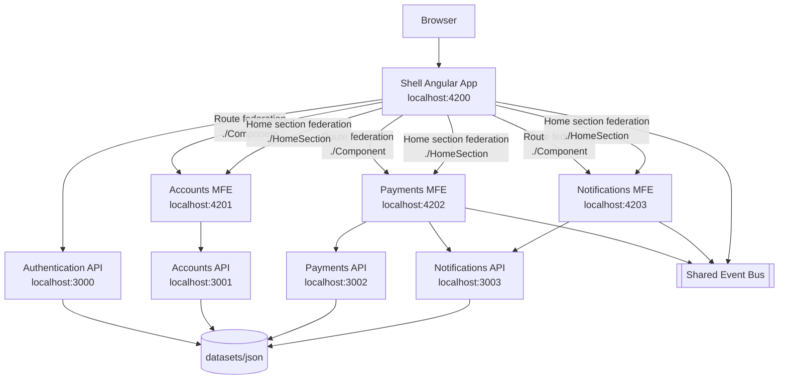
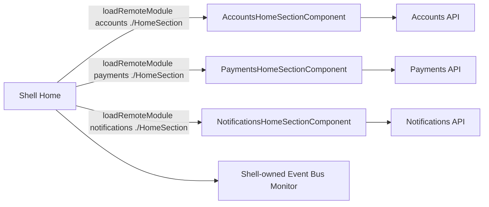
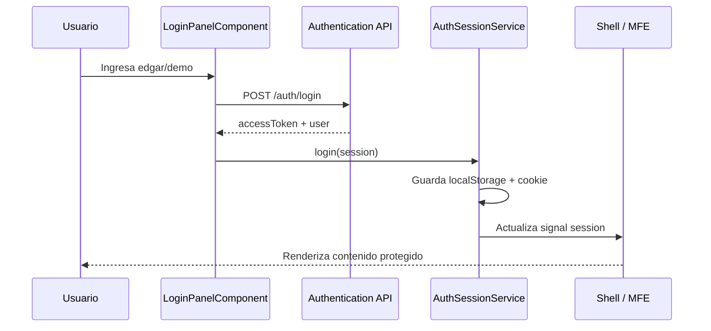
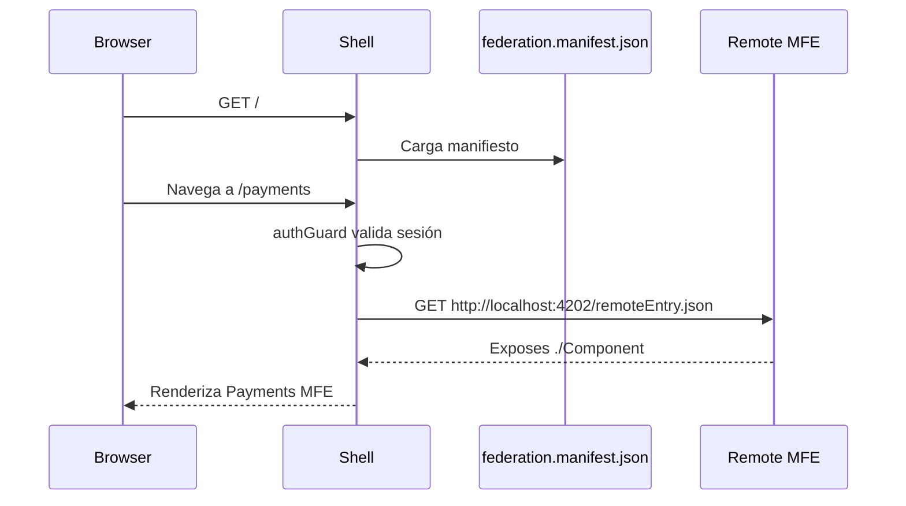
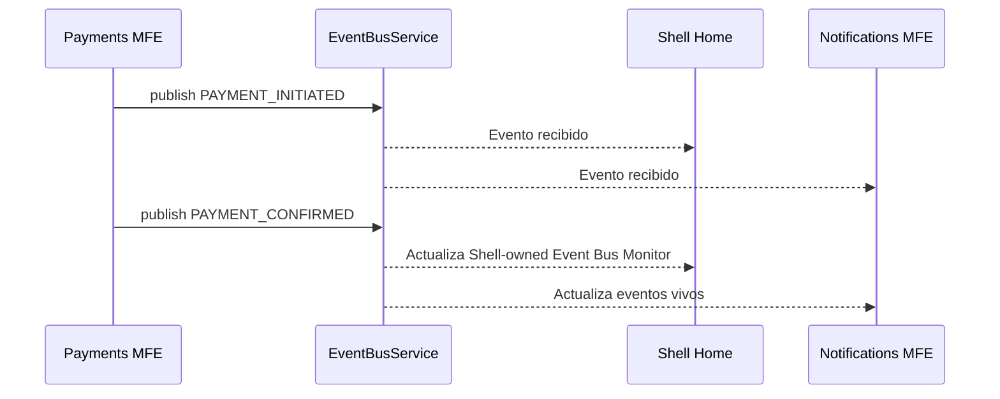
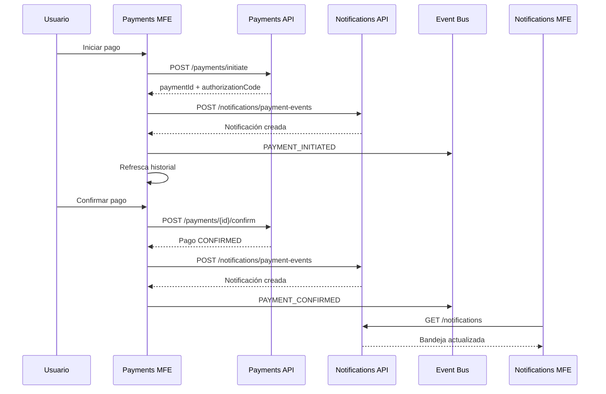
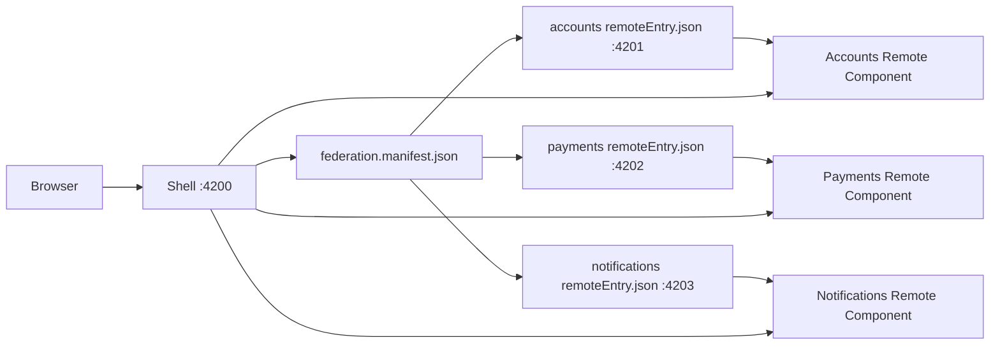
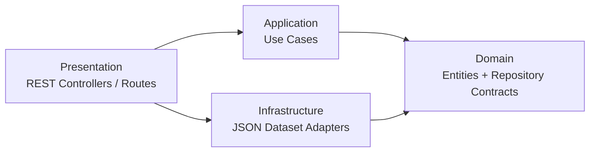

# Payment Processing PoC - Angular 21 Native Federation

## 1. Descripción funcional

Esta PoC implementa un flujo simplificado de **Payment Processing** usando Angular con 
**Standalone Components** y **Native Federation**.

La solución está compuesta por un **Shell** que orquesta la navegación, 
la autenticación compartida, la carga remota de Microfrontends y la comunicación entre 
componentes mediante un Event Bus frontend.

Los dominios funcionales principales son:

- **Accounts MFE**: consulta cuentas, consulta tarjetas y registra beneficiarios.
- **Payments MFE**: inicia pagos, confirma pagos, consulta historial y publica eventos.
- **Notifications MFE**: consulta notificaciones, marca notificaciones como leídas y refleja eventos de pagos.

Cada dominio backend es un servicio REST independiente:

- `authentication-api`
- `accounts-api`
- `payments-api`
- `notifications-api`

Toda la solución corre localmente, usa datasets JSON como fuente mock.

## 2. Tipos de microfrontends

Esta versión demuestra dos niveles de Microfrontends:

| Patrón | Dónde se ve | Descripción |
|---|---|---|
| **Route-level Microfrontends** | `/accounts`, `/payments`, `/notifications` | El Shell carga una aplicación remota completa por ruta. |
| **Section-level Microfrontends** | Home `/` | El Shell carga secciones/cards federadas expuestas por cada MFE. |

En el Home del Shell, las secciones marcadas como:

- **Accounts MFE / Cuentas y tarjetas**
- **Payments MFE / Últimos pagos**
- **Notifications MFE / Bandeja y alertas**

**No son cards locales del Shell**. Son componentes remotos expuestos por cada Microfrontend mediante Native Federation.

La única sección local del Shell en el Home es:

```text
SHELL-OWNED EVENT BUS MONITOR
```

Esa sección pertenece al Shell porque representa el monitoreo global de eventos emitidos por los MFEs.

## 3. Angular 21 baseline

La PoC está alineada a Angular 21.x:

| Elemento | Versión usada |
|---|---|
| Angular framework | `21.2.17` |
| Angular CLI | `21.2.18` |
| Native Federation | `@angular-architects/native-federation@21.2.5` |
| TypeScript | `5.9.3` |
| Node.js recomendado | `22.16.0` |
| Backend runtime | Node.js 22 + Express 5 |


## 4. Stack tecnológico

| Capa | Tecnología |
|---|---|
| Frontend | Angular 21.2.x, Standalone Components, Angular Router |
| Microfrontends | `@angular-architects/native-federation` |
| Comunicación frontend | Event Bus basado en `window.CustomEvent` + RxJS |
| Sesión compartida mock | `localStorage`, cookie local y sincronización periódica |
| HTTP frontend | `HttpClient`, `withFetch`, interceptor funcional |
| Backend | Node.js 22, Express 5, TypeScript 5.9 |
| Validación de comandos | Zod |
| Datasets | JSON local |
| Infraestructura local | Docker Compose + Nginx |
| Requests | REST Client `.http` |
| Testing backend | Node Test Runner |

## 5. Arquitectura general



## 6. Estructura del proyecto

```text
payment-processing-poc/
├── angular.json
├── package.json
├── README.md
├── VALIDATION.md
├── tsconfig.json
├── projects/
│   ├── shell/
│   │   ├── public/
│   │   │   └── federation.manifest.json
│   │   └── src/app/
│   │       ├── app.routes.ts
│   │       ├── home.component.ts
│   │       ├── home.component.html
│   │       ├── login.component.ts
│   │       └── app.ts
│   ├── accounts/
│   │   ├── federation.config.js
│   │   └── src/app/
│   │       ├── app.ts
│   │       └── accounts-home-section.component.ts
│   ├── payments/
│   │   ├── federation.config.js
│   │   └── src/app/
│   │       ├── app.ts
│   │       └── payments-home-section.component.ts
│   ├── notifications/
│   │   ├── federation.config.js
│   │   └── src/app/
│   │       ├── app.ts
│   │       └── notifications-home-section.component.ts
│   └── shared/
│       └── src/lib/
│           ├── api-config.ts
│           ├── auth-api.service.ts
│           ├── auth-session.service.ts
│           ├── auth-token.interceptor.ts
│           ├── auth.guard.ts
│           ├── event-bus.service.ts
│           ├── login-panel.component.ts
│           └── models.ts
├── backends/
│   ├── authentication/
│   ├── accounts/
│   ├── payments/
│   └── notifications/
├── datasets/
│   ├── json/
│   └── scripts/
├── requests/
│   ├── payment-processing-poc.http
│   └── responses/
└── infrastructure/
    ├── docker-compose.yml
    ├── frontend.Dockerfile
    ├── nginx/
    ├── manifests/
    ├── mock-services/
    ├── requests/
    ├── responses/
    └── scripts/
```

## 7. Shell

El Shell es la aplicación principal.

Responsabilidades:

- Cargar `federation.manifest.json`.
- Resolver rutas remotas hacia Accounts, Payments y Notifications.
- Cargar secciones federadas de Home expuestas por cada MFE.
- Gestionar login/logout demo.
- Proteger rutas remotas usando `authGuard`.
- Mantener navegación principal.
- Escuchar eventos globales del Event Bus.
- Mostrar el monitor local `Shell-owned Event Bus Monitor`.

Rutas principales:

| Ruta | Origen | Protección | Descripción |
|---|---|---|---|
| `/` | Shell + secciones federadas | Requiere sesión para mostrar secciones remotas | Home con secciones remotas de cada MFE |
| `/login` | Shell | Pública | Login mock compartido |
| `/accounts` | Accounts MFE | `authGuard` | Gestión de cuentas, tarjetas y beneficiarios |
| `/payments` | Payments MFE | `authGuard` | Inicio y confirmación de pagos |
| `/notifications` | Notifications MFE | `authGuard` | Bandeja de notificaciones |

## 8. Microfrontends

## 8.1 Accounts MFE

Responsabilidades:

- Consultar cuentas.
- Consultar tarjetas asociadas a una cuenta.
- Consultar beneficiarios.
- Registrar beneficiarios mock.
- Exponer una sección federada para el Home del Shell.
- Bloquear contenido cuando se abre standalone sin sesión.

Backend asociado: `accounts-api`.

Exposes principales:

```js
exposes: {
  './Component': './projects/accounts/src/app/app.ts',
  './HomeSection': './projects/accounts/src/app/accounts-home-section.component.ts',
}
```

## 8.2 Payments MFE

Responsabilidades:

- Iniciar pago.
- Recibir código mock de autorización.
- Confirmar pago.
- Consultar historial.
- Refrescar historial automáticamente después de iniciar o confirmar pagos.
- Publicar eventos `PAYMENT_INITIATED` y `PAYMENT_CONFIRMED`.
- Registrar notificaciones mock en `notifications-api` mediante `/notifications/payment-events`.
- Exponer una sección federada para el Home del Shell.
- Bloquear contenido cuando se abre standalone sin sesión.

Backend asociado: `payments-api`.

Exposes principales:

```js
exposes: {
  './Component': './projects/payments/src/app/app.ts',
  './HomeSection': './projects/payments/src/app/payments-home-section.component.ts',
}
```

## 8.3 Notifications MFE

Responsabilidades:

- Consultar notificaciones.
- Refrescar bandeja automáticamente.
- Marcar notificaciones como leídas.
- Escuchar eventos vivos del Event Bus.
- Exponer una sección federada para el Home del Shell.
- Bloquear contenido cuando se abre standalone sin sesión.

Backend asociado: `notifications-api`.

Exposes principales:

```js
exposes: {
  './Component': './projects/notifications/src/app/app.ts',
  './HomeSection': './projects/notifications/src/app/notifications-home-section.component.ts',
}
```

## 9. Home compuesto por secciones federadas

El Home del Shell carga dinámicamente componentes remotos usando Native Federation:

```ts
loadRemoteModule('accounts', './HomeSection')
loadRemoteModule('payments', './HomeSection')
loadRemoteModule('notifications', './HomeSection')
```

Cada remoto devuelve un componente standalone:

| Remote name | Expose | Componente remoto |
|---|---|---|
| `accounts` | `./HomeSection` | `AccountsHomeSectionComponent` |
| `payments` | `./HomeSection` | `PaymentsHomeSectionComponent` |
| `notifications` | `./HomeSection` | `NotificationsHomeSectionComponent` |

El Shell renderiza esos componentes mediante `NgComponentOutlet`.



## 10. Shared Library

La librería `projects/shared` contiene elementos reutilizables:

| Elemento | Responsabilidad |
|---|---|
| `AuthSessionService` | Administra sesión compartida mock con `localStorage`, cookie local y sincronización. |
| `AuthApiService` | Consume `authentication-api` para login/logout. |
| `authTokenInterceptor` | Agrega `Authorization: Bearer <accessToken>` a las llamadas HTTP. |
| `authGuard` | Protege rutas remotas del Shell. |
| `LoginPanelComponent` | Componente standalone de login reutilizado por Shell y MFEs. |
| `EventBusService` | Publica y escucha eventos mediante `window.CustomEvent`. |
| `PAYMENT_PROCESSING_API_CONFIG` | Configuración de URLs locales de APIs. |
| `models.ts` | Contratos compartidos. |

Exports esperados en `projects/shared/src/public-api.ts`:

```ts
export * from './lib/api-config';
export * from './lib/auth-api.service';
export * from './lib/auth-session.service';
export * from './lib/auth-token.interceptor';
export * from './lib/auth.guard';
export * from './lib/event-bus.service';
export * from './lib/login-panel.component';
export * from './lib/models';
```

Importante: cuando se modifica `projects/shared`, se debe recompilar la librería antes de levantar Shell/MFEs:

```bash
npm run build:shared
```

El script `start:all` ya ejecuta `npm run build:shared` automáticamente.

## 11. Sesión compartida entre Shell y MFEs

La autenticación es mock y local. No se usa proveedor real de identidad ni OAuth/OIDC real.

Credenciales demo:

```text
username: edgar
password: demo
```

La sesión se comparte entre:

- Shell: `http://localhost:4200`
- Accounts MFE: `http://localhost:4201`
- Payments MFE: `http://localhost:4202`
- Notifications MFE: `http://localhost:4203`

Mecanismos usados:

1. `localStorage` con la clave `payment-processing.session`.
2. Cookie local `payment_processing_session` con `Path=/` y `SameSite=Lax`.
3. Evento browser `payment-processing.session.changed`.
4. Sincronización periódica cada 1 segundo para apps abiertas en puertos distintos.
5. Interceptor HTTP que envía el token mock en cada llamada.

Flujo de autenticación:




## 12. Flujo de navegación remota



## 13. Flujo de comunicación mediante Event Bus



El Event Bus es frontend-only y usa `window.CustomEvent`. 
Sirve para demostrar comunicación entre MFEs cargados dentro de la misma ventana/shell.

Si se abren MFEs en pestañas separadas, el Event Bus no cruza pestañas. Para cubrir ese caso, `Payments MFE` registra eventos de pago en `notifications-api`, y `Notifications MFE` refresca su bandeja contra el backend mock.

## 14. Flujo de notificaciones de pagos

Cuando se inicia o confirma un pago, el flujo actual es:



Esto simula una integración asincrónica sin usar brokers ni infraestructura adicional.

## 15. Manifest Native Federation

Archivo:

```text
projects/shell/public/federation.manifest.json
```

Contenido:

```json
{
  "accounts": "http://localhost:4201/remoteEntry.json",
  "payments": "http://localhost:4202/remoteEntry.json",
  "notifications": "http://localhost:4203/remoteEntry.json"
}
```

El Shell resuelve dinámicamente cada remoto con:

```ts
loadRemoteModule('payments', './Component')
loadRemoteModule('payments', './HomeSection')
```

Cada MFE expone su componente principal y su sección de Home en su `federation.config.js`:

```js
exposes: {
  './Component': './projects/payments/src/app/app.ts',
  './HomeSection': './projects/payments/src/app/payments-home-section.component.ts',
}
```



## 16. Despliegue independiente

Cada frontend se puede construir y servir de forma independiente:

| Aplicación | Puerto local | Artefacto |
|---|---:|---|
| Shell | 4200 | `dist/shell/browser` |
| Accounts MFE | 4201 | `dist/accounts/browser` |
| Payments MFE | 4202 | `dist/payments/browser` |
| Notifications MFE | 4203 | `dist/notifications/browser` |

En Docker Compose cada aplicación se sirve con Nginx en su propio contenedor.

También se pueden abrir los MFEs directamente:

```text
Accounts MFE       http://localhost:4201
Payments MFE       http://localhost:4202
Notifications MFE  http://localhost:4203
Shell              http://localhost:4200
```

Si no existe sesión compartida, los MFEs standalone muestran el login y no renderizan el contenido funcional.

## 17. Backends

Cada backend es independiente y mantiene esta estructura mínima:

```text
src/
├── domain/
│   ├── entities/
│   └── repositories/
├── application/
│   ├── ports/
│   └── use-cases/
├── infrastructure/
│   └── persistence/
└── presentation/
    ├── http/
    ├── routes/
    └── server.ts
```

## 18. Clean Architecture y Hexagonal Architecture




## 19. Endpoints

| Orden | Dominio | Método | URL | Descripción funcional | Descripción técnica |
|---:|---|---|---|---|---|
| 1 | Authentication | GET | `http://localhost:3000/health` | Verifica disponibilidad | Health check del servicio |
| 2 | Authentication | POST | `http://localhost:3000/auth/login` | Login demo | Valida usuario desde `users.json` y devuelve token mock |
| 3 | Authentication | GET | `http://localhost:3000/auth/me` | Consulta perfil | Devuelve usuario mock autenticado |
| 4 | Authentication | POST | `http://localhost:3000/auth/logout` | Logout demo | Devuelve confirmación de logout |
| 5 | Accounts | GET | `http://localhost:3001/health` | Verifica disponibilidad | Health check del servicio |
| 6 | Accounts | GET | `http://localhost:3001/accounts/summary` | Sección federada de Home | Agrega saldos y número de tarjetas |
| 7 | Accounts | GET | `http://localhost:3001/accounts` | Consulta cuentas | Lee `accounts.json` |
| 8 | Accounts | GET | `http://localhost:3001/accounts/{id}/cards` | Consulta tarjetas | Filtra `cards.json` por cuenta |
| 9 | Accounts | GET | `http://localhost:3001/beneficiaries` | Consulta beneficiarios | Lee `beneficiaries.json` |
| 10 | Accounts | POST | `http://localhost:3001/beneficiaries` | Registro de beneficiario | Valida comando con Zod y guarda en memoria |
| 11 | Payments | GET | `http://localhost:3002/health` | Verifica disponibilidad | Health check del servicio |
| 12 | Payments | GET | `http://localhost:3002/payments/history?limit=3` | Sección federada de Home / historial | Ordena pagos por fecha y aplica límite |
| 13 | Payments | GET | `http://localhost:3002/payments` | Lista pagos | Lee pagos iniciales y pagos creados en memoria |
| 14 | Payments | POST | `http://localhost:3002/payments/initiate` | Inicia pago | Crea pago `INITIATED` y código mock |
| 15 | Payments | POST | `http://localhost:3002/payments/{id}/confirm` | Confirma pago | Valida código mock y cambia estado a `CONFIRMED` |
| 16 | Payments | GET | `http://localhost:3002/payments/{id}` | Consulta pago | Busca pago por identificador |
| 17 | Notifications | GET | `http://localhost:3003/health` | Verifica disponibilidad | Health check del servicio |
| 18 | Notifications | GET | `http://localhost:3003/notifications?limit=5` | Consulta notificaciones | Lee `notifications.json` y aplica límite |
| 19 | Notifications | POST | `http://localhost:3003/notifications/{id}/read` | Marca notificación | Cambia estado `read` en memoria |
| 20 | Notifications | POST | `http://localhost:3003/notifications/payment-events` | Registra evento de pago | Crea notificación mock desde evento de pago |

## 20. Datos iniciales

Los datasets están en:

```text
datasets/json/
├── accounts.json
├── beneficiaries.json
├── cards.json
├── movements.json
├── notifications.json
├── payments.json
└── users.json
```

Los backends cargan estos archivos al iniciar mediante la variable:

```text
DATASET_PATH=$PWD/datasets/json
```

Para revisar o resetear los datasets locales:

```bash
./datasets/scripts/reset-local-datasets.sh
```

No hay base de datos. Los cambios realizados por POST se guardan en memoria mientras el 
backend correspondiente esté ejecutándose.

## 21. Requests y responses

Archivo principal REST Client:

```text
requests/payment-processing-poc.http
```

También hay respuestas de ejemplo en:

```text
requests/responses/
infrastructure/responses/
```

## 22. Ejecutar toda la solución con Docker Compose

Desde la raíz del proyecto:

```bash
npm run docker:up
```

Esto ejecuta:

- Shell: `http://localhost:4200`
- Accounts MFE: `http://localhost:4201`
- Payments MFE: `http://localhost:4202`
- Notifications MFE: `http://localhost:4203`
- Authentication API: `http://localhost:3000`
- Accounts API: `http://localhost:3001`
- Payments API: `http://localhost:3002`
- Notifications API: `http://localhost:3003`

Health check:

```bash
./infrastructure/scripts/health-check.sh
```

Apagar:

```bash
npm run docker:down
```

## 23. Ejecutar localmente sin Docker

## 23.1 Instalación recomendada

Desde la raíz:

```bash
cd ~/Workspace/payment-processing-poc
npm run install:all
```

El script `install:all` instala:

- Dependencias del workspace Angular raíz.
- Dependencias de `backends/authentication`.
- Dependencias de `backends/accounts`.
- Dependencias de `backends/payments`.
- Dependencias de `backends/notifications`.

## 23.2 Instalación manual detallada

Instalar dependencias frontend:

```bash
npm install --no-audit --no-fund --registry=https://registry.npmjs.org/
```

Instalar dependencias backend:

```bash
npm --prefix backends/authentication install --no-audit --no-fund --registry=https://registry.npmjs.org/
npm --prefix backends/accounts install --no-audit --no-fund --registry=https://registry.npmjs.org/
npm --prefix backends/payments install --no-audit --no-fund --registry=https://registry.npmjs.org/
npm --prefix backends/notifications install --no-audit --no-fund --registry=https://registry.npmjs.org/
```

Si vienes de un ZIP anterior o un lock generado en otro entorno, puedes limpiar antes:

```bash
rm -rf node_modules package-lock.json
rm -rf backends/authentication/node_modules backends/authentication/package-lock.json
rm -rf backends/accounts/node_modules backends/accounts/package-lock.json
rm -rf backends/payments/node_modules backends/payments/package-lock.json
rm -rf backends/notifications/node_modules backends/notifications/package-lock.json
```

Luego reinstala con los comandos anteriores.

## 23.3 Compilar todo

```bash
npm run build:all
```

Compilación por partes:

```bash
npm run build:shared
npm run build:frontends
npm run build:apis
```

## 23.4 Ejecutar APIs en terminales separadas

```bash
npm run start:api:authentication
npm run start:api:accounts
npm run start:api:payments
npm run start:api:notifications
```

## 23.5 Ejecutar frontends en terminales separadas

```bash
npm run start:accounts-mfe
npm run start:payments-mfe
npm run start:notifications-mfe
npm run start:shell
```

## 23.6 Ejecutar todo junto

Opción recomendada:

```bash
npm run start:all
```

Este script ejecuta primero:

```bash
npm run build:shared
```

y luego levanta APIs, MFEs y Shell con `concurrently`.

Comando manual equivalente:

```bash
npm install --no-audit --no-fund --registry=https://registry.npmjs.org/ --verbose
npm --prefix backends/authentication install --no-audit --no-fund --registry=https://registry.npmjs.org/ --verbose
npm --prefix backends/accounts install --no-audit --no-fund --registry=https://registry.npmjs.org/ --verbose
npm --prefix backends/payments install --no-audit --no-fund --registry=https://registry.npmjs.org/ --verbose
npm --prefix backends/notifications install --no-audit --no-fund --registry=https://registry.npmjs.org/ --verbose

export DATASET_PATH="$(pwd)/datasets/json"

npx concurrently -k \
  -n auth-api,accounts-api,payments-api,notifications-api,accounts-mfe,payments-mfe,notifications-mfe,shell \
  "PORT=3000 DATASET_PATH=$DATASET_PATH npm --prefix backends/authentication run dev" \
  "PORT=3001 DATASET_PATH=$DATASET_PATH npm --prefix backends/accounts run dev" \
  "PORT=3002 DATASET_PATH=$DATASET_PATH npm --prefix backends/payments run dev" \
  "PORT=3003 DATASET_PATH=$DATASET_PATH npm --prefix backends/notifications run dev" \
  "npm run start:accounts-mfe" \
  "npm run start:payments-mfe" \
  "npm run start:notifications-mfe" \
  "npm run start:shell"
```

Abrir:

```text
Shell              http://localhost:4200
Accounts MFE       http://localhost:4201
Payments MFE       http://localhost:4202
Notifications MFE  http://localhost:4203
```

## 24. Scripts principales

| Script | Descripción |
|---|---|
| `npm run install:all` | Instala dependencias del workspace y de todos los backends. |
| `npm run build:shared` | Compila la librería compartida. |
| `npm run build:frontends` | Compila Shell y MFEs. |
| `npm run build:apis` | Compila los cuatro backends. |
| `npm run build:all` | Compila frontends y APIs. |
| `npm run start:apis` | Levanta las cuatro APIs. |
| `npm run start:frontends` | Compila shared y levanta Shell + MFEs. |
| `npm run start:all` | Compila shared y levanta APIs + Shell + MFEs. |
| `npm run test:apis` | Ejecuta pruebas unitarias de backends. |
| `npm run docker:up` | Levanta la solución con Docker Compose. |
| `npm run docker:down` | Apaga Docker Compose y elimina volúmenes. |

## 25. Agregar un nuevo Microfrontend

1. Crear la aplicación Angular:

```bash
npx ng generate application new-domain --standalone --routing --style=scss --ssr=false
```

2. Inicializar Native Federation:

```bash
npx ng g @angular-architects/native-federation:init --project new-domain --port 4204 --type remote
```

3. Exponer el componente principal en `projects/new-domain/federation.config.js`:

```js
exposes: {
  './Component': './projects/new-domain/src/app/app.ts',
}
```

4. Agregar el remoto al manifest del Shell:

```json
{
  "new-domain": "http://localhost:4204/remoteEntry.json"
}
```

5. Agregar ruta en `projects/shell/src/app/app.routes.ts`:

```ts
{
  path: 'new-domain',
  canActivate: [authGuard],
  loadComponent: () => loadRemoteModule('new-domain', './Component').then((m) => m.App),
}
```

6. Agregar servicio Docker Compose si se requiere despliegue local independiente.

## 26. Agregar una nueva sección federada al Home

Este es el patrón recomendado para evitar cards locales en el Shell.

1. Crear un componente standalone en el MFE:

```text
projects/new-domain/src/app/new-domain-home-section.component.ts
```

2. Exponerlo en `federation.config.js`:

```js
exposes: {
  './Component': './projects/new-domain/src/app/app.ts',
  './HomeSection': './projects/new-domain/src/app/new-domain-home-section.component.ts',
}
```

3. Cargarlo desde el Home del Shell:

```ts
readonly newDomainHomeSection = loadRemoteModule('new-domain', './HomeSection')
  .then((m) => m.NewDomainHomeSectionComponent);
```

4. Renderizarlo con `NgComponentOutlet`:

```html
@if (newDomainHomeSection | async; as section) {
  <ng-container *ngComponentOutlet="section"></ng-container>
}
```

5. Mantener la navegación de detalle con `routerLink` hacia la ruta remota:

```html
<a routerLink="/new-domain">Ver detalle</a>
```

## 27. Agregar un nuevo Widget local del Shell

Este patrón se mantiene como opción cuando el widget pertenece realmente al Shell, 
como el monitor de Event Bus.

1. Crear o extender el endpoint backend que entregue el agregado necesario.
2. Consumir el endpoint desde el componente del Shell.
3. Agregar la tarjeta visual en el HTML del Shell.
4. Si el widget depende de eventos, suscribirse a `EventBusService.events$`.

Regla recomendada:

- Si el widget representa una capacidad de un dominio, exponerlo desde el MFE dueño del dominio.
- Si el widget representa una capacidad transversal del Shell, implementarlo localmente en el Shell.

## 28. Agregar un nuevo backend

1. Crear carpeta bajo `backends/new-domain`.
2. Mantener estructura:

```text
src/domain
src/application
src/infrastructure
src/presentation
```

3. Definir entidades y contratos en `domain`.
4. Crear casos de uso en `application/use-cases`.
5. Implementar adaptadores mock en `infrastructure/persistence`.
6. Exponer endpoints en `presentation/routes`.
7. Agregar `Dockerfile` y servicio en `infrastructure/docker-compose.yml`.
8. Agregar ejemplos al archivo `requests/payment-processing-poc.http`.
9. Agregar el nuevo backend al script `install:all`, `build:apis`, `start:apis` y `start:all`.

## 29. Pruebas

## 29.1 Pruebas backend

Ejecutar todas:

```bash
npm run test:apis
```

Pruebas incluidas:

| Backend | Prueba funcional | Prueba técnica |
|---|---|---|
| Authentication | Usuario demo puede autenticarse | `LoginUseCase` genera token mock |
| Accounts | Se agregan saldos y tarjetas | `GetAccountSummaryUseCase` usa contrato de repositorio |
| Payments | Pago puede iniciarse y confirmarse | `InitiatePaymentUseCase` + `ConfirmPaymentUseCase` |
| Notifications | Notificación puede marcarse como leída | `MarkNotificationReadUseCase` cambia estado |

## 29.2 Pruebas frontend

Ejecutar:

```bash
npm test
```

Requiere Chrome/Chromium disponible y variable `CHROME_BIN` configurada si el binario no está en el PATH.

## 30. Validación manual recomendada

1. Instalar dependencias con `npm run install:all`.
2. Levantar la solución con `npm run start:all`.
3. Abrir `http://localhost:4200`.
4. Verificar que el Home solicite login si no hay sesión.
5. Iniciar sesión con `edgar / demo`.
6. Verificar que el Home muestre las secciones federadas de Accounts, Payments y Notifications.
7. Navegar a `Accounts` y verificar cuentas, tarjetas y beneficiarios.
8. Registrar un beneficiario y verificar que la lista se refresque.
9. Navegar a `Payments`.
10. Iniciar pago y verificar que el historial se refresque con estado `INITIATED`.
11. Confirmar pago y verificar que el historial se refresque con estado `CONFIRMED`.
12. Verificar que el monitor Event Bus del Shell recibe eventos.
13. Navegar a `Notifications` y verificar que se crearon notificaciones por eventos de pago.
14. Marcar una notificación como leída y verificar que la bandeja se refresque.
15. Abrir `http://localhost:4201`, `http://localhost:4202` y `http://localhost:4203` sin sesión y verificar que cada MFE muestre login.
16. Consumir endpoints desde `requests/payment-processing-poc.http`.

## 31. Comandos útiles de diagnóstico

Verificar registry público:

```bash
npm config get registry
```

Debe responder:

```text
https://registry.npmjs.org/
```

Buscar referencias a registry interno:

```bash
grep -R "applied-caas-gateway" package-lock.json backends/*/package-lock.json 2>/dev/null
```

Verificar Angular CLI local:

```bash
ls -la node_modules/.bin/ng
npx ng version
```

Verificar `tsx` en backends:

```bash
ls -la backends/authentication/node_modules/.bin/tsx
ls -la backends/accounts/node_modules/.bin/tsx
ls -la backends/payments/node_modules/.bin/tsx
ls -la backends/notifications/node_modules/.bin/tsx
```

Verificar datasets:

```bash
ls -la datasets/json
```

Verificar health checks:

```bash
curl http://localhost:3000/health
curl http://localhost:3001/health
curl http://localhost:3002/health
curl http://localhost:3003/health
```

Verificar remotes:

```bash
curl http://localhost:4201/remoteEntry.json
curl http://localhost:4202/remoteEntry.json
curl http://localhost:4203/remoteEntry.json
```
